### Partie 1 : Installation et configuration du cluster (1 semaine)

1. Installer Minikube sur votre machine de développement avec au moins 4 GO de RAM et 2 CPU
2. Activer les addons nécessaires : metrics-server, dashboard
3. Configurer kubectl pour interagir avec votre cluster
4. Installer le dashboard Kubernetes pour visualiser les ressources
5. Documenter précisément votre configuration avec des captures d'écran et les commandes utilisées

**Livrable attendu** : Document décrivant l'installation avec les commandes utilisées et les captures d'écran de vérification du bon fonctionnement.


Installation et configuration du cluster Kubernetes avec Minikube

### 🔧 Prérequis
- Système d’exploitation : Linux, macOS ou Windows
- Virtualisation activée (VirtualBox, Docker Desktop, Hyper-V…)
- 4 Go de RAM et 2 CPU minimum disponibles pour Minikube
- Outils à installer :
    - kubectl
    - Minikube


### ✅ Étape 1 : Installation de Minikube et kubectl
```sh
# 📦 Installer kubectl
curl -LO "https://dl.k8s.io/release/$(curl -s https://dl.k8s.io/release/stable.txt)/bin/linux/amd64/kubectl"
chmod +x kubectl
sudo mv kubectl /usr/local/bin/
kubectl version --client
```

📸 Capture à faire : Résultat de kubectl version --client
Nom capture : `kubectl_version.png`
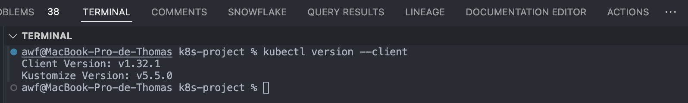


```sh
# 📦 Installer Minikube
curl -LO https://storage.googleapis.com/minikube/releases/latest/minikube-linux-amd64
sudo install minikube-linux-amd64 /usr/local/bin/minikube
minikube version
```

📸 Capture à faire : Résultat de minikube version
Nom capture : `minikube_version.png`
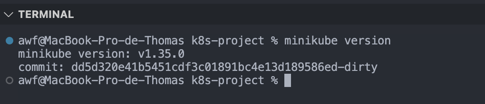


### ✅ Étape 2 : Lancer Minikube avec la configuration requise
```sh
# 🚀 Démarrer Minikube avec 4 Go de RAM et 2 CPU
minikube start --cpus=2 --memory=4096 --driver=docker
```

📸 Capture à faire : Résultat du démarrage avec confirmation du succès (ex: "Done! kubectl is now configured...")
Nom capture : `minikube_start.png`
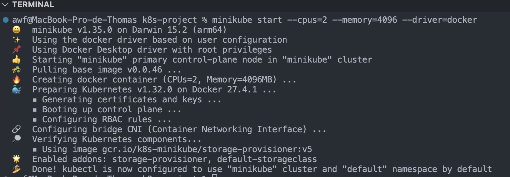


### ✅ Étape 3 : Activer les addons metrics-server et dashboard
```sh
# ⚙️ Activer les addons
minikube addons enable metrics-server
minikube addons enable dashboard

minikube addons list
```

📸 Capture à faire : Résultat des commandes ou liste des addons activés avec :
nom capture : `minikube_addons_list.png`
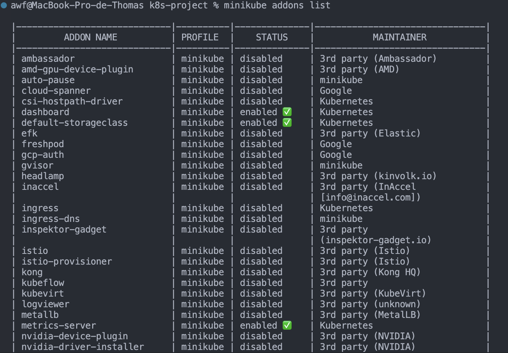


### ✅ Étape 4 : Vérifier le bon fonctionnement de Kubernetes
```sh
# 🔍 Vérifier l'état du cluster
minikube status

kubectl get nodes
kubectl get pods -A
```
📸 Capture à faire : Résultat de minikube status
Nom capture : `minikube_status.png`
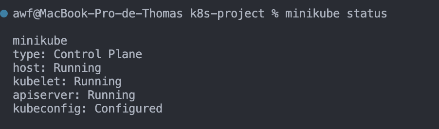


nom capture : `kubectl_get_nodes.png`   
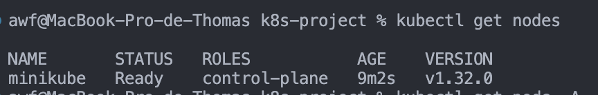


nom capture : `kubectl_get_pods.png`
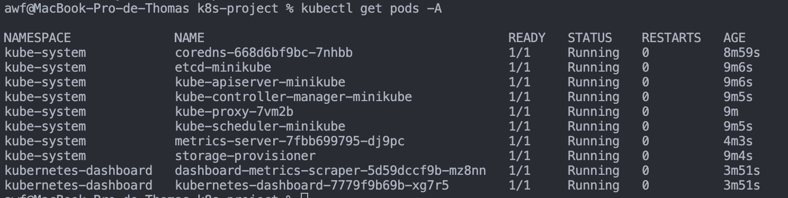

### ✅ Étape 5 : Accéder au dashboard Kubernetes
```sh
# 🌐 Accéder au dashboard
minikube dashboard
```
📸 Capture à faire : Résultat de l'ouverture du dashboard
Nom capture : `minikube_dashboard.png`
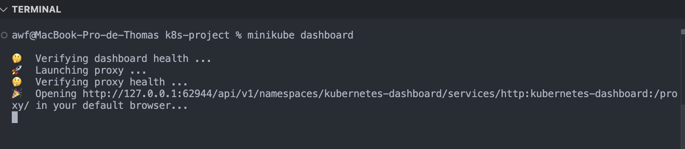
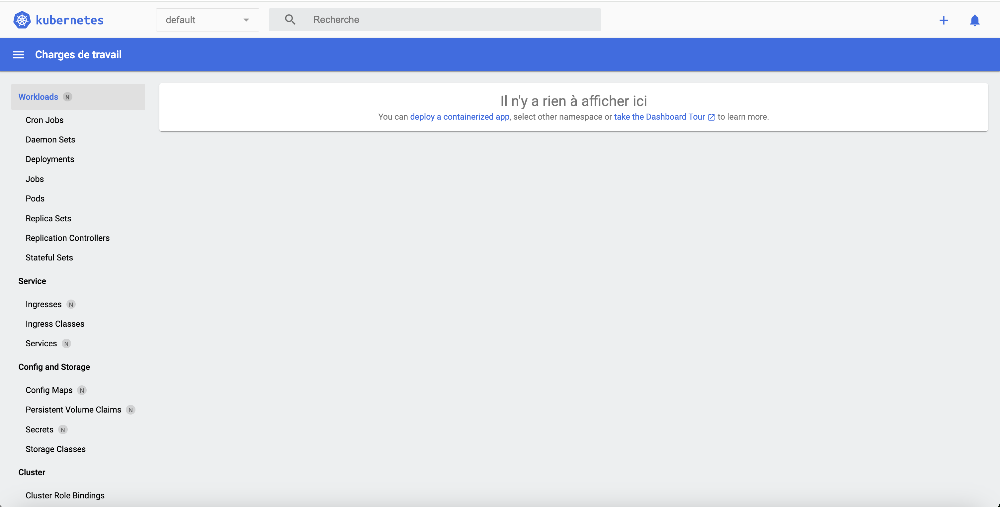


### ✅ Bonus : Configuration de kubectl si nécessaire
Minikube configure normalement kubectl automatiquement. Pour vérifier :
```sh
# 🔧 Vérifier la configuration de kubectl
kubectl config current-context
kubectl config view
```
📸 Capture à faire : Résultat de kubectl config current-context
📸 Capture à faire : Résultat indiquant que le contexte courant est minikube
Nom capture : `kubectl_config_current_context.png`
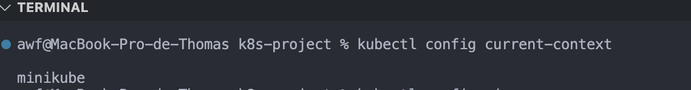


nom capture : `kubectl_config_view.png`
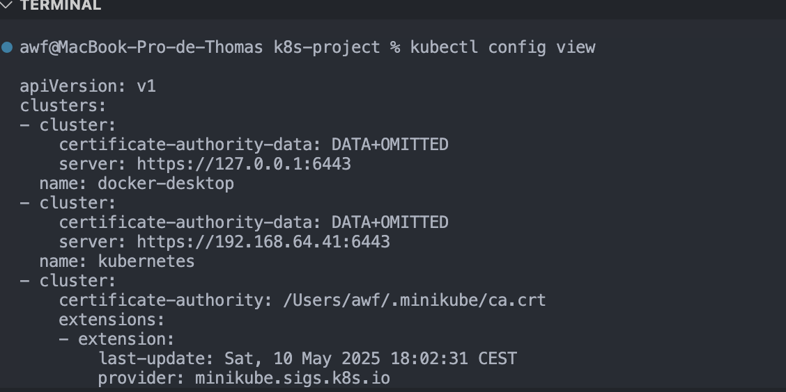


### 📂 Structure recommandée du livrable
Organise ton livrable de cette façon :
```
- installation_steps.md
    - kubectl_version.png
    - minikube_version.png
    - minikube_start.png
    - minikube_addons_list.png
    - minikube_status.png
    - kubectl_get_nodes.png
    - kubectl_get_pods.png
    - minikube_dashboard-terminal.png
    - minikube_dashboard.png
    - kubectl_config_current_context.png
    - kubectl_config_view.png
```
