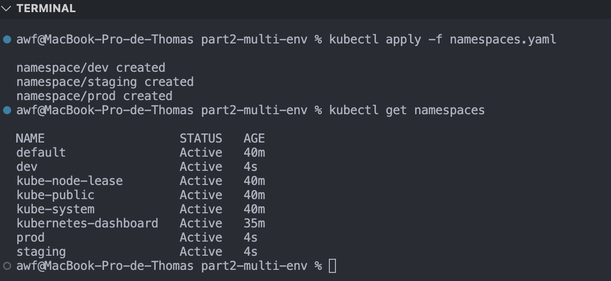
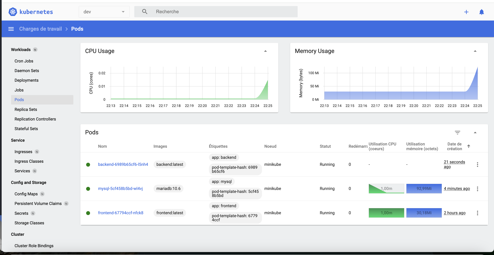

```sh
3k8s-project/
├── part1-installation/
│   ├── installation_steps.md
│   └── screenshots/
├── part2-multi-env/
│   ├── dev/
│   │   ├── backend.yaml
│   │   ├── frontend.yaml
│   │   ├── mysql.yaml
│   │   ├── configmap.yaml
│   │   ├── secret.yaml
│   │   └── limitrange.yaml
│   ├── staging/
│   ├── prod/
├── part3-security-access/
│   ├── rbac/
│   ├── network-policies/
│   ├── resource-quotas/
├── part4-deploy-monitoring/
│   ├── hpa/
│   ├── prometheus/
│   ├── grafana/
│   └── nodeport-services/
├── diagrams/
├── scripts/
├── architecture.md
└── presentation.pdf
```

## Partie 2 : Création d'une architecture multi-environnements

1. Créer trois namespaces distincts avec des configurations spécifiques :
    - dev : pour le développement (ressources limitées)
    - staging : pour les tests (ressources moyennes)
    - prod : pour la production simulée (ressources prioritaires)
2. Pour chaque namespace, déployer :
    - Un déploiement MySQL avec :
        - Un volume persistant pour les données
        - Un secret pour le mot de passe root
        - Un ConfigMap pour les paramètres de configuration
        - Un service pour l'exposer uniquement en interne
    - Un déploiement pour l'API backend avec :
        - Une configuration pour se connecter à la base de données correspondante
        - Des readiness et liveness probes pour vérifier son bon fonctionnement
        - Un service pour l'exposer
    - Un déploiement pour le frontend avec :
        - Une configuration pour se connecter à l'API backend
        - Un service pour l'exposer à l'extérieur
3. S'assurer que les applications peuvent communiquer entre elles uniquement dans leur namespace respectif
4. Configurer des variables d'environnement différentes pour chaque environnement via des ConfigMaps
5. Mettre en place des limites de ressources différentes selon l'environnement à l'aide de LimitRange

**Livrable attendu** : Fichiers YAML de configuration pour tous les déploiements, services, ConfigMaps, secrets et PersistentVolumes, ainsi qu'un schéma d'architecture montrant comment les composants interagissent.


### 🎯 Objectif
Déployer une architecture en 3 environnements (dev, staging, prod) dans un cluster Kubernetes Minikube, avec isolation stricte, configurations spécifiques, et déploiement de trois applications : MySQL, Backend API, Frontend.


### 📁 Structure des fichiers
```sh
3k8s-project/

├── part2-multi-env/
│   ├── dev/
│   │   ├── backend.yaml
│   │   ├── frontend.yaml
│   │   ├── mysql.yaml
│   │   ├── configmap.yaml
│   │   ├── secret.yaml
│   │   └── limitrange.yaml
│   ├── staging/
│   ├── prod/
```

### ✅ Étape 1 : Créer les namespaces
```sh
# Créer les namespaces
# namespaces.yaml
apiVersion: v1
kind: Namespace
metadata:
  name: dev
---
apiVersion: v1
kind: Namespace
metadata:
  name: staging
---
apiVersion: v1
kind: Namespace
metadata:
  name: prod
```

```sh
# Appliquer le fichier de configuration
kubectl apply -f namespaces.yaml

# Vérifier la création des namespaces
kubectl get namespaces
```
capture à faire : Résultat de la création des namespaces
nom capture : `kubectl_get_namespaces.png`



### ✅ Étape 2 : Déploiements par namespace
Tu vas répéter la structure suivante pour chaque environnement (dev, staging, prod), avec quelques variations :

#### 📂 Exemple pour dev :


multi-env/
├── dev/
│   ├── mysql-secret.yaml
│   ├── mysql-configmap.yaml
│   ├── mysql-pvc.yaml
│   ├── mysql-deployment.yaml
│   ├── backend-deployment.yaml
│   ├── frontend-deployment.yaml
│   ├── services.yaml
│   ├── configmap.yaml
│   └── limits.yaml

##### 📁 1. MySQL
**🧪 Secret**
```sh
#🧪 Secret : mysql-secret.yaml
apiVersion: v1
kind: Secret
metadata:
  name: mysql-secret
  namespace: dev
type: Opaque
data:
  MYSQL_ROOT_PASSWORD: bXlwYXNzd29yZA==  # 'mypassword' en base64
```

**🧪 ConfigMap**
```sh
#🧪 ConfigMap : mysql-configmap.yaml
apiVersion: v1
kind: ConfigMap
metadata:
  name: mysql-config
  namespace: dev
data:
  MYSQL_DATABASE: devdb
  MYSQL_USER: devuser
  MYSQL_PASSWORD: devpassword
```

**🧪 PersistentVolumeClaim**
```sh   
#🧪 PersistentVolumeClaim : mysql-pvc.yaml
apiVersion: v1
kind: PersistentVolumeClaim
metadata:
  name: mysql-pvc
  namespace: dev
spec:
  accessModes:
    - ReadWriteOnce
  resources:
    requests:
      storage: 1Gi
```

**🧪 🚀 Déploiement + Service
```sh
#🧪 🚀 Déploiement + Service : mysql-deployment.yaml
apiVersion: apps/v1
kind: Deployment
metadata:
  name: mysql
  namespace: dev
spec:
  replicas: 1
  selector:
    matchLabels:
      app: mysql
  template:
    metadata:
      labels:
        app: mysql
    spec:
      containers:
        - name: mysql
          image: arm64v8/mysql:8.0
          # Or use MariaDB which has good ARM support:
          # image: mariadb:10.6
          env:
            - name: MYSQL_ROOT_PASSWORD
              valueFrom:
                secretKeyRef:
                  name: mysql-secret
                  key: MYSQL_ROOT_PASSWORD
            - name: MYSQL_DATABASE
              valueFrom:
                configMapKeyRef:
                  name: mysql-config
                  key: MYSQL_DATABASE
            - name: MYSQL_USER
              valueFrom:
                configMapKeyRef:
                  name: mysql-config
                  key: MYSQL_USER
            - name: MYSQL_PASSWORD
              valueFrom:
                configMapKeyRef:
                  name: mysql-config
                  key: MYSQL_PASSWORD
          ports:
            - containerPort: 3306
          volumeMounts:
            - name: mysql-data
              mountPath: /var/lib/mysql
      volumes:
        - name: mysql-data
          persistentVolumeClaim:
            claimName: mysql-pvc
---
apiVersion: v1
kind: Service
metadata:
  name: mysql
  namespace: dev
spec:
  selector:
    app: mysql
  ports:
    - port: 3306
  clusterIP: None  # Service interne uniquement
```


##### 📁 2. Backend API
```yaml
#🧪 🚀 Déploiement + Service : backend-deployment.yaml
apiVersion: apps/v1
kind: Deployment
metadata:
  name: backend
  namespace: dev
spec:
  replicas: 1
  selector:
    matchLabels:
      app: backend
  template:
    metadata:
      labels:
        app: backend
    spec:
      containers:
        - name: backend
          image: backend:latest
          imagePullPolicy: Never
          env:
            - name: DB_HOST
              value: mysql
          ports:
            - containerPort: 8000
          readinessProbe:
            httpGet:
              path: /health
              port: 8000
            initialDelaySeconds: 5
            periodSeconds: 10
          livenessProbe:
            httpGet:
              path: /health
              port: 8000
            initialDelaySeconds: 15
            periodSeconds: 20
---
apiVersion: v1
kind: Service
metadata:
  name: backend
  namespace: dev
spec:
  selector:
    app: backend
  ports:
    - port: 8000
```

##### 📁 3. Frontend
```yaml
#🧪 🚀 Déploiement + Service : frontend-deployment.yaml
apiVersion: apps/v1
kind: Deployment
metadata:
  name: frontend
  namespace: dev
spec:
  replicas: 1
  selector:
    matchLabels:
      app: frontend
  template:
    metadata:
      labels:
        app: frontend
    spec:
      containers:
        - name: frontend
          image: frontend:latest
          imagePullPolicy: Never
          env:
            - name: API_URL
              value: http://backend.dev.svc.cluster.local:8000
          ports:
            - containerPort: 3000
---
apiVersion: v1
kind: Service
metadata:
  name: frontend
  namespace: dev
spec:
  type: NodePort
  selector:
    app: frontend
  ports:
    - port: 3000
      nodePort: 30080
```


### ✅ Étape 3 : Isolation réseau
Par défaut, les namespaces dans Kubernetes sont isolés au niveau DNS. Si nécessaire, tu peux renforcer ça avec des NetworkPolicies pour autoriser uniquement la communication intra-namespace (optionnel sur Minikube si le CNI est limité).

### ✅ Étape 4 : ConfigMaps spécifiques à chaque env
```yaml
#🧪 ConfigMap : configmap.yaml
apiVersion: v1
kind: ConfigMap
metadata:
  name: env-config
  namespace: dev
data:
  ENV: development
---
apiVersion: v1
kind: ConfigMap
metadata:
  name: env-config
  namespace: staging
data:
  ENV: staging
---
apiVersion: v1
kind: ConfigMap
metadata:
  name: env-config
  namespace: prod
data:
  ENV: production
```

### ✅ Étape 5 : LimitRange pour chaque namespace
```yaml
#🧪 LimitRange : limits.yaml
apiVersion: v1
kind: LimitRange
metadata:
  name: resource-limits
  namespace: dev
spec:
  limits:
    - default:
        memory: 256Mi
        cpu: "500m"
      defaultRequest:
        memory: 128Mi
        cpu: "250m"
      type: Container
---
apiVersion: v1
kind: LimitRange
metadata:
  name: resource-limits
  namespace: staging
spec:
  limits:
    - default:
        memory: 512Mi
        cpu: "1"
      defaultRequest:
        memory: 256Mi
        cpu: "500m"
      type: Container
---
apiVersion: v1
kind: LimitRange
metadata:
  name: resource-limits
  namespace: prod
spec:
  limits:
    - default:
        memory: 1024Mi
        cpu: "2"
      defaultRequest:
        memory: 512Mi
        cpu: "1"
      type: Container
```

### 📌 Fichiers YAML à fournir dans le livrable

Organise-les dans une structure comme :
```
3k8s-project/
├── part2-multi-env/
│   ├── dev/
│   │   ├── mysql-secret.yaml
│   │   ├── mysql-configmap.yaml
│   │   ├── mysql-pvc.yaml
│   │   ├── mysql-deployment.yaml
│   │   ├── backend-deployment.yaml
│   │   ├── frontend-deployment.yaml
│   │   ├── services.yaml
│   │   ├── configmap.yaml
│   │   └── limits.yaml
│   ├── staging/
    ├── prod/
├   namespaces.yaml
```


### 📌 Exemple d'architecture
exemple complet et minimaliste pour chaque composant (backend et frontend) avec les Dockerfiles correspondants. Ces apps sont parfaites pour simuler le comportement dans ton cluster Kubernetes.

```Dockerfile
# backend/Dockerfile
FROM python:3.10-slim

WORKDIR /app
COPY requirements.txt ./
RUN pip install -r requirements.txt

COPY app.py .

EXPOSE 5000
CMD ["python", "app.py"]
```

```Dockerfile
# frontend/Dockerfile
FROM node:18-slim

WORKDIR /app
COPY package.json ./
RUN npm install

COPY index.js ./

EXPOSE 3000
CMD ["npm", "start"]
```


### ✅ Étapes pour builder et tester localement avec Minikube


```sh
minikube start --memory=4096 --cpus=2

# Build local images
docker build -t backend:latest ./backend
docker build -t frontend:latest ./frontend

# Charger dans Minikube
minikube image load backend:latest
minikube image load frontend:latest

# verifier les images chargées dans Minikube
minikube ssh
docker images

```


Step 3: Apply the Configuration
```sh
# Apply namespaces first
kubectl apply -f part2-multi-env/namespaces.yaml

# For each environment (starting with dev):
# 1. Create the Secret
kubectl apply -f part2-multi-env/dev/mysql-secret.yaml

# 2. Create the ConfigMaps
kubectl apply -f part2-multi-env/dev/mysql-configmap.yaml
kubectl apply -f part2-multi-env/dev/configmap.yaml

# 3. Create the PVC
kubectl apply -f part2-multi-env/dev/mysql-pvc.yaml

# 4. Create LimitRange
kubectl apply -f part2-multi-env/dev/limits.yaml

# 5. Deploy applications
kubectl apply -f part2-multi-env/dev/mysql-deployment.yaml
kubectl apply -f part2-multi-env/dev/backend-deployment.yaml
kubectl apply -f part2-multi-env/dev/frontend-deployment.yaml

```

### ✅ Étape 6 : Vérification
```sh
# Vérifier les déploiements
kubectl get deployments -n dev
kubectl get pods -n dev
kubectl get services -n dev
kubectl get pvc -n dev
kubectl get secrets -n dev
kubectl get configmaps -n dev
kubectl get limitrange -n dev
```


