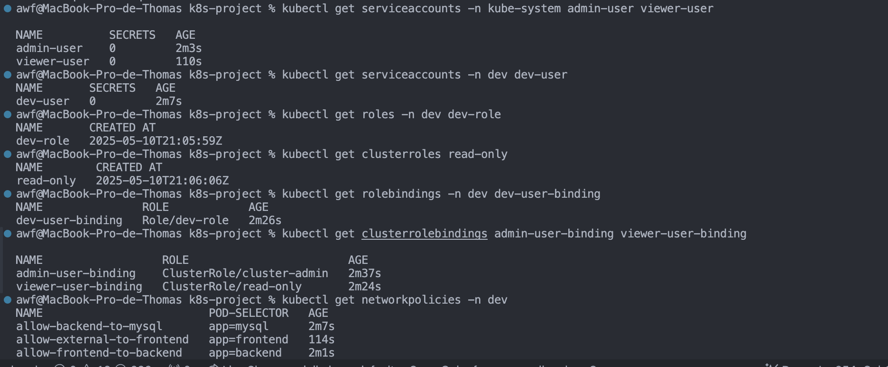

```sh
3k8s-project/
├── part1-installation/
│   ├── installation_steps.md
│   └── screenshots/
├── part2-multi-env/
│   ├── dev/
│   │   ├── backend.yaml
│   │   ├── frontend.yaml
│   │   ├── mysql.yaml
│   │   ├── configmap.yaml
│   │   ├── secret.yaml
│   │   └── limitrange.yaml
│   ├── staging/
│   ├── prod/
├── part3-security-access/
│   ├── rbac/
│   ├── network-policies/
│   ├── resource-quotas/
├── part4-deploy-monitoring/
│   ├── hpa/
│   ├── prometheus/
│   ├── grafana/
│   └── nodeport-services/
├── diagrams/
├── scripts/
├── architecture.md
└── presentation.pdf
```


## Partie 3 : Sécurité et contrôle d'accès

1. Créer trois comptes utilisateurs avec différents niveaux d'accès :
    - `admin-user` : accès complet à tous les namespaces
    - `dev-user` : accès en lecture/écriture uniquement au namespace `dev`
    - `viewer-user` : accès en lecture seule à tous les namespaces
2. Configurer les Roles, ClusterRoles, RoleBindings et ClusterRoleBindings nécessaires
3. Mettre en place des NetworkPolicies (activer le CNI approprié dans Minikube) pour :
    - Isoler les bases de données (accessible uniquement par les backends du même namespace)
    - Limiter l'accès aux backends (accessibles uniquement par les frontends du même namespace)
    - Permettre l'accès externe uniquement aux frontends
4. Configurer des ResourceQuotas pour chaque namespace afin de limiter :
    - Le nombre total de pods
    - La consommation de CPU et mémoire
    - Le nombre de services, secrets et configmaps

**Livrable attendu** : Fichiers YAML pour la configuration RBAC et les NetworkPolicies, documentation des tests effectués pour vérifier que les restrictions fonctionnent correctement.


### 🔐 Étape 1 : Création des utilisateurs et configuration RBAC
📌 Objectif
Créer trois utilisateurs avec les permissions suivantes :

Utilisateur	Permissions
- `admin-user`	: Accès complet sur tout le cluster
- `dev-user`	: Accès complet uniquement sur le namespace dev
- `viewer-user`	: Lecture seule sur tout le cluster

ℹ️ Ces utilisateurs sont généralement simulés dans Minikube avec des certificats client.

#### 📁 rbac/
Contient les rôles, comptes et bindings :

```yaml
# admin-user.yaml
apiVersion: v1
kind: ServiceAccount
metadata:
  name: admin-user
  namespace: kube-system
---
apiVersion: rbac.authorization.k8s.io/v1
kind: ClusterRoleBinding
metadata:
  name: admin-user-binding
subjects:
  - kind: ServiceAccount
    name: admin-user
    namespace: kube-system
roleRef:
  kind: ClusterRole
  name: cluster-admin
  apiGroup: rbac.authorization.k8s.io
```

```yaml
# dev-user.yaml
apiVersion: v1
kind: ServiceAccount
metadata:
  name: dev-user
  namespace: dev
---
apiVersion: rbac.authorization.k8s.io/v1
kind: Role
metadata:
  name: dev-role
  namespace: dev
rules:
  - apiGroups: [""]
    resources: ["pods", "services", "configmaps", "secrets"]
    verbs: ["get", "list", "create", "update", "delete"]
---
apiVersion: rbac.authorization.k8s.io/v1
kind: RoleBinding
metadata:
  name: dev-user-binding
  namespace: dev
subjects:
  - kind: ServiceAccount
    name: dev-user
    namespace: dev
roleRef:
  kind: Role
  name: dev-role
  apiGroup: rbac.authorization.k8s.io
---
apiVersion: rbac.authorization.k8s.io/v1
kind: Role
metadata:
  name: dev-role
  namespace: dev
rules:
  - apiGroups: [""]
    resources: ["pods", "services", "configmaps", "secrets", "persistentvolumeclaims"]
    verbs: ["get", "list", "create", "update", "delete", "watch"]
  - apiGroups: ["apps"]
    resources: ["deployments", "statefulsets", "replicasets"]
    verbs: ["get", "list", "create", "update", "delete", "watch"]
  - apiGroups: ["networking.k8s.io"]
    resources: ["ingresses"]
    verbs: ["get", "list", "create", "update", "delete"]
```

```yaml
# viewer-user.yaml
apiVersion: v1
kind: ServiceAccount
metadata:
  name: viewer-user
  namespace: kube-system
---
apiVersion: rbac.authorization.k8s.io/v1
kind: ClusterRole
metadata:
  name: read-only
rules:
  - apiGroups: [""]
    resources: ["pods", "services", "configmaps", "secrets"]
    verbs: ["get", "list"]
---
apiVersion: rbac.authorization.k8s.io/v1
kind: ClusterRoleBinding
metadata:
  name: viewer-user-binding
subjects:
  - kind: ServiceAccount
    name: viewer-user
    namespace: kube-system
roleRef:
  kind: ClusterRole
  name: read-only
  apiGroup: rbac.authorization.k8s.io
---
apiVersion: rbac.authorization.k8s.io/v1
kind: ClusterRole
metadata:
  name: read-only
rules:
  - apiGroups: [""]
    resources: ["pods", "services", "configmaps", "secrets", "namespaces", "nodes", "persistentvolumeclaims"]
    verbs: ["get", "list", "watch"]
  - apiGroups: ["apps"]
    resources: ["deployments", "statefulsets", "replicasets"]
    verbs: ["get", "list", "watch"]
  - apiGroups: ["networking.k8s.io"]
    resources: ["ingresses", "networkpolicies"]
    verbs: ["get", "list", "watch"]
```

#### 📁 network-policies/
Contient les restrictions d'accès par pod :
```yaml
# mysql-isolated.yaml
apiVersion: networking.k8s.io/v1
kind: NetworkPolicy
metadata:
  name: allow-backend-to-mysql
  namespace: dev
spec:
  podSelector:
    matchLabels:
      app: mysql
  ingress:
    - from:
        - podSelector:
            matchLabels:
              app: backend
  policyTypes:
    - Ingress
---
apiVersion: networking.k8s.io/v1
kind: NetworkPolicy
metadata:
  name: default-deny
  namespace: dev
spec:
  podSelector: {}
  policyTypes:
  - Ingress
  - Egress
```

```yaml
# backend-restricted.yaml
apiVersion: networking.k8s.io/v1
kind: NetworkPolicy
metadata:
  name: allow-frontend-to-backend
  namespace: dev
spec:
  podSelector:
    matchLabels:
      app: backend
  ingress:
    - from:
        - podSelector:
            matchLabels:
              app: frontend
  policyTypes:
    - Ingress
```

```yaml
# frontend-access.yaml
apiVersion: networking.k8s.io/v1
kind: NetworkPolicy
metadata:
  name: allow-external-to-frontend
  namespace: dev
spec:
  podSelector:
    matchLabels:
      app: frontend
  ingress:
    - {}
  policyTypes:
    - Ingress
```


#### 📁 resource-quotas/
Pour limiter la charge par namespace :
```yaml
# resource-quota-dev.yaml
apiVersion: v1
kind: ResourceQuota
metadata:
  name: dev-quota
  namespace: dev
spec:
  hard:
    pods: "10"
    requests.cpu: "2"
    requests.memory: "2Gi"
    limits.cpu: "4"
    limits.memory: "4Gi"
    services: "5"
    configmaps: "10"
    secrets: "10"
```

**Implementation Notes**
For this to all work correctly in your Minikube environment:
```sh
#Enable NetworkPolicy support:

#minikube addons enable pod-security-policy
```

**⚠️ Remarque** : Assure-toi que le CNI dans Minikube supporte les NetworkPolicies (calico ou cilium). Par exemple, tu peux démarrer Minikube avec :
```sh
#minikube start --cni=calico
```

### Step 3: Enable NetworkPolicy Support in Minikube
Since you're using NetworkPolicies, you need to ensure that your Minikube cluster supports them:
```sh
# If minikube is already running, stop it
minikube stop

# Start minikube with NetworkPolicy support
minikube start --cni=calico

# Alternatively, if you prefer not to restart
minikube addons enable pod-security-policy

# Check if the addon is enabled
minikube addons list

# open dashboard
minikube dashboard
```


### Step 4: Apply the YAML Files
Now, let's apply all the YAML files:
```sh
# Apply RBAC configurations
kubectl apply -f part3-security-access/rbac/admin-user.yaml
kubectl apply -f part3-security-access/rbac/dev-user.yaml
kubectl apply -f part3-security-access/rbac/viewer-user.yaml

# Apply NetworkPolicies
kubectl apply -f part3-security-access/network-policies/mysql-isolated.yaml
kubectl apply -f part3-security-access/network-policies/backend-restricted.yaml
kubectl apply -f part3-security-access/network-policies/frontend-access.yaml

# Apply ResourceQuotas
kubectl apply -f part3-security-access/resource-quotas/resource-quota-dev.yaml
```


### Step 5: Verify the Configurations
Verify that everything was applied correctly:
```sh
# Check the ServiceAccounts
kubectl get serviceaccounts -n kube-system admin-user viewer-user
kubectl get serviceaccounts -n dev dev-user

# Check Roles and ClusterRoles
kubectl get roles -n dev dev-role
kubectl get clusterroles read-only

# Check RoleBindings and ClusterRoleBindings
kubectl get rolebindings -n dev dev-user-binding
kubectl get clusterrolebindings admin-user-binding viewer-user-binding

# Check NetworkPolicies
kubectl get networkpolicies -n dev

# Check ResourceQuotas
kubectl get resourcequotas -n dev
```

📸 Capture à faire : Résultat de la commande kubectl get serviceaccounts
Nom capture : `kubectl_get_serviceaccounts.png`



### Tests to Verify RBAC and Network Policy Restrictions
Here are comprehensive tests to verify that your security restrictions are working correctly. You can add these to your documentation.


#### 1. Testing RBAC Permissions
**Admin User Tests**
```sh
# Get the token for admin-user
# SECRET_NAME=$(kubectl get serviceaccount admin-user -n kube-system -o jsonpath='{.secrets[0].name}')
# TOKEN=$(kubectl get secret $SECRET_NAME -n kube-system -o jsonpath='{.data.token}' | base64 --decode)

# get token
# echo $TOKEN
# echo $SECRET_NAME

minikube status
kubectl get serviceaccount admin-user -n kube-system

kubectl create token admin-user -n kube-system --duration=24h


# Create kubeconfig file for admin-user
cat > admin-kubeconfig << EOF
apiVersion: v1
kind: Config
clusters:
- name: minikube
  cluster:
    server: https://$(minikube ip):8443
    insecure-skip-tls-verify: true
users:
- name: admin-user
  user:
    token: $TOKEN
contexts:
- context:
    cluster: minikube
    user: admin-user
  name: admin-context
current-context: admin-context
EOF


# Test admin operations - should all succeed
kubectl --kubeconfig=admin-kubeconfig get nodes
kubectl --kubeconfig=admin-kubeconfig get pods --all-namespaces
kubectl --kubeconfig=admin-kubeconfig create namespace test-namespace
kubectl --kubeconfig=admin-kubeconfig delete namespace test-namespace
```

**Option 1: Use kubectl's proxy feature**
Instead of trying to access the minikube API server directly, you can use kubectl's proxy feature to access it through your regular kubeconfig:

```sh
# Start the kubectl proxy in the background
kubectl proxy &

# Create a kubeconfig file that uses the proxy
cat > admin-kubeconfig-proxy << EOF
apiVersion: v1
kind: Config
clusters:
- name: minikube-proxy
  cluster:
    server: http://127.0.0.1:8001
users:
- name: admin-user
  user:
    token: eyJhbGciOiJSUzI1NiIsImtpZCI6IjB0b2wxamNEUzVHcWhYU2gwRUs5Y1V4X01XQm5FMTVzdVJpQXE3T045V0EifQ.eyJhdWQiOlsiaHR0cHM6Ly9rdWJlcm5ldGVzLmRlZmF1bHQuc3ZjLmNsdXN0ZXIubG9jYWwiXSwiZXhwIjoxNzQ2OTk4OTg5LCJpYXQiOjE3NDY5MTI1ODksImlzcyI6Imh0dHBzOi8va3ViZXJuZXRlcy5kZWZhdWx0LnN2Yy5jbHVzdGVyLmxvY2FsIiwianRpIjoiMzdiYzY4MjQtMjQ4Zi00NDUyLTk4YjYtNzhlMmZlZGUzNzFiIiwia3ViZXJuZXRlcy5pbyI6eyJuYW1lc3BhY2UiOiJrdWJlLXN5c3RlbSIsInNlcnZpY2VhY2NvdW50Ijp7Im5hbWUiOiJhZG1pbi11c2VyIiwidWlkIjoiNjIxZGVmNTYtZTVmYi00ODBkLThiZTUtYzhhODViYWE4MDkwIn19LCJuYmYiOjE3NDY5MTI1ODksInN1YiI6InN5c3RlbTpzZXJ2aWNlYWNjb3VudDprdWJlLXN5c3RlbTphZG1pbi11c2VyIn0.cNAnT5pfPOWWzLpAcYpjwxff6KUMLPdFTioEuleP69dBENTWMP3_UTZz6NtPa9KaaNYNXL5oeqSyiIMn3LUllE5OyXwWRwqqhR5oXnZuiydC-8OG8UGu1omtzYeIMtjXaJE0huHegknu6IypDOMcvwX3U-GneXNQ-9dnamDEBNBYGi3ykdbD3ItZd0acZ4vSCKGAAgZNtAD-zrM6racRLg1ZkTyNwOPmR9W1a9XCmPMnmrnK-kXfapZ1opg_5wIUquj1DUcB2nhsE1-VLLq0jfd2tMtffv2ME9jdnvJaO9f8FTwiGlMYcU-2ey6ujFgnxYP31BWwqdNHN9AMSAbung
contexts:
- context:
    cluster: minikube-proxy
    user: admin-user
  name: admin-context
current-context: admin-context
EOF

# Try to access the cluster through the proxy
kubectl --kubeconfig=admin-kubeconfig-proxy get nodes
```

**Option 2: Use minikube's built-in kubeconfig**
Instead of creating your own kubeconfig, you can use minikube's kubeconfig with the service account token:
```sh
# Get the token
TOKEN=$(kubectl create token admin-user -n kube-system --duration=24h)

# Use minikube's kubeconfig but with your token
kubectl --token=$TOKEN get nodes
```

nom de la capture : `minikube_get_nodes.png`


**Dev User Tests**
```sh
# Get the token for dev-user
SECRET_NAME=$(kubectl get serviceaccount dev-user -n dev -o jsonpath='{.secrets[0].name}')
TOKEN=$(kubectl get secret $SECRET_NAME -n dev -o jsonpath='{.data.token}' | base64 --decode)


# Create kubeconfig file for dev-user
cat > dev-kubeconfig << EOF
apiVersion: v1
kind: Config
clusters:
- name: minikube
  cluster:
    server: https://$(minikube ip):8443
    insecure-skip-tls-verify: true
users:
- name: dev-user
  user:
    token: $TOKEN
contexts:
- context:
    cluster: minikube
    user: dev-user
  name: dev-context
current-context: dev-context
EOF

# Tests that should succeed (in dev namespace)
kubectl --kubeconfig=dev-kubeconfig get pods -n dev
kubectl --kubeconfig=dev-kubeconfig create pod test-pod --image=nginx -n dev
kubectl --kubeconfig=dev-kubeconfig delete pod test-pod -n dev

# Tests that should fail (outside dev namespace)
kubectl --kubeconfig=dev-kubeconfig get pods -n default
kubectl --kubeconfig=dev-kubeconfig create pod test-pod --image=nginx -n default
```


**Viewer User Tests**
```sh
# Get the token for viewer-user
SECRET_NAME=$(kubectl get serviceaccount viewer-user -n kube-system -o jsonpath='{.secrets[0].name}')
TOKEN=$(kubectl get secret $SECRET_NAME -n kube-system -o jsonpath='{.data.token}' | base64 --decode)

# Create kubeconfig file for viewer-user
cat > viewer-kubeconfig << EOF
apiVersion: v1
kind: Config
clusters:
- name: minikube
  cluster:
    server: https://$(minikube ip):8443
    insecure-skip-tls-verify: true
users:
- name: viewer-user
  user:
    token: $TOKEN
contexts:
- context:
    cluster: minikube
    user: viewer-user
  name: viewer-context
current-context: viewer-context
EOF

# Tests that should succeed (read-only operations)
kubectl --kubeconfig=viewer-kubeconfig get pods --all-namespaces
kubectl --kubeconfig=viewer-kubeconfig get services --all-namespaces
kubectl --kubeconfig=viewer-kubeconfig get deployments --all-namespaces

# Tests that should fail (write operations)
kubectl --kubeconfig=viewer-kubeconfig create pod test-pod --image=nginx -n dev
kubectl --kubeconfig=viewer-kubeconfig delete pod -n dev $(kubectl get pods -n dev -o name | head -1)


For testing RBAC, create kubeconfig files for each user:
```sh
# Get the token for a service account
SECRET_NAME=$(kubectl get serviceaccount viewer-user -n kube-system -o jsonpath='{.secrets[0].name}')
TOKEN=$(kubectl get secret $SECRET_NAME -n kube-system -o jsonpath='{.data.token}' | base64 --decode)

echo $TOKEN
echo $SECRET_NAME
```

Then create a kubeconfig file for each user:
```yaml
# # Create a kubeconfig file
# viewer-kubeconfig.yaml
apiVersion: v1
kind: Config
clusters:
- name: minikube
  cluster:
    server: $(minikube ip):8443
    certificate-authority: $(minikube config view --format='{{ .KubeConfig }}')/ca.crt
users:
- name: viewer-user
  user:
    token: $TOKEN
contexts:
- context:
    cluster: minikube
    user: viewer-user
  name: viewer-context
current-context: viewer-context
```

Test your configuration:
```sh
# Test with viewer user (should succeed for read operations)
kubectl --kubeconfig=viewer-kubeconfig.yaml get pods -n dev

# Test with viewer user (should fail for write operations)
kubectl --kubeconfig=viewer-kubeconfig.yaml create pod test-pod --image=nginx -n dev
```